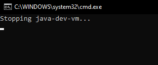
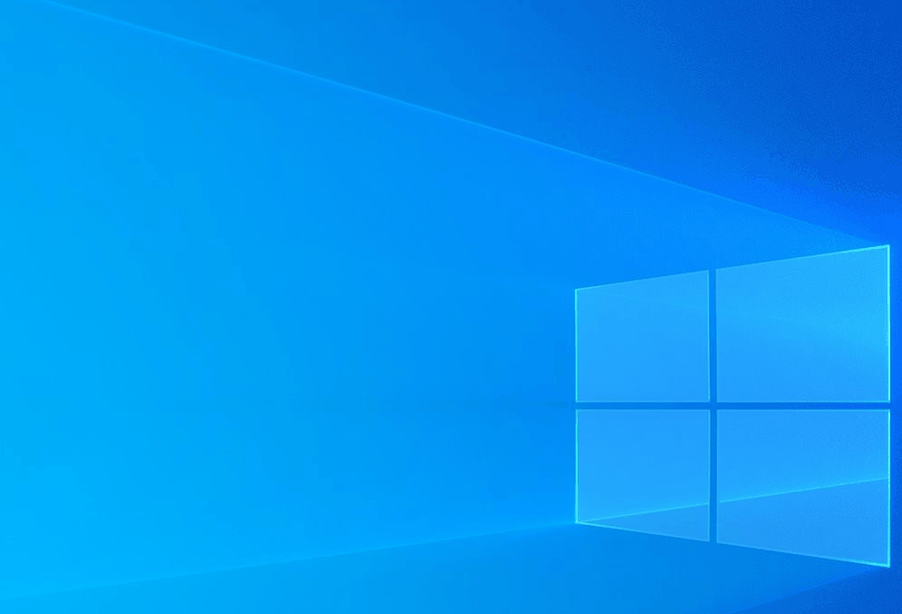
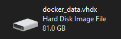
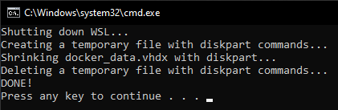

<p align="center">
    
</p>

<p align="center">
  <a href="src/java-dev-vm-docker/src/main/docker/Dockerfile" rel="noreferrer">
      
  </a>
  <a href="https://hub.docker.com/r/javaheim/java-dev-vm" rel="noreferrer">
      
  </a>
  <a href="https://github.com/javaheim/java-dev-vm/releases" rel="noreferrer">
      
  </a>
  <a href="LICENSE" rel="noreferrer">
      
  </a>
  <br>
  <a href="https://github.com/javaheim/java-dev-vm/actions/workflows/main.yml" rel="noreferrer">
      
  </a>
  <a href="https://github.com/javaheim/java-dev-vm/actions/workflows/attestation-verification.yml" rel="noreferrer">
      
  </a>
</p>

## 💻 Java DEV VM: One VM to Code Them All

> _Less configuration, more creation_

> [!CAUTION]
> 🛠️ This repository is under active development.
>
> Only Early Access (EA) builds are provided at this stage.

The **Java DEV VM** is a **powerful development environment** designed specifically **for Java Developers working on
Windows** or **Linux**. This Virtual Machine is based on [Ubuntu](https://hub.docker.com/_/ubuntu), providing a familiar
Linux environment that integrates
seamlessly
with Windows through Docker Desktop or Linux through Docker Engine.

The main advantage of the Java DEV VM is its **time-saving** nature. Developers no longer need to spend valuable time
manually setting up their development environment or installing the necessary tools. Everything you need - such as Java,
IDE,
build tools, Version Control System, Docker, Kubernetes and so on - is **pre-configured and ready to go right out of the
box**.

With the Java DEV VM, developers can **focus on writing code and delivering high-quality software**, instead of worrying
about installation issues or environment configuration. It's an ideal solution for anyone looking for a streamlined,
efficient, and hassle-free Java development experience.

It requires **2** dependencies on Windows:

* [**WSL version 2**](https://learn.microsoft.com/en-us/windows/wsl/install) (Windows Subsystem for Linux) - lets you
  install a Linux distribution and use Linux applications, utilities, and Bash command-line tools directly on Windows,
  unmodified, without the overhead of a traditional virtual machine or dualboot setup. Check quickly if you have it with
  command: `wsl --version` in CMD/PowerShell
* [**Docker Desktop**](https://docs.docker.com/desktop/install/windows-install/) - lets you build, share, and run
  containerized applications. It provides a straightforward GUI (Graphical User Interface) that lets
  you manage your containers, applications, and images directly from your machine

It requires only **1** dependency on Linux:

* [**Docker Engine**](https://docs.docker.com/engine/install/) - lets you build, share, and run
  containerized applications. It does not provide any GUI, management is performed via CLI

Java DEV VM image can be pulled from DockerHub: https://hub.docker.com/r/javaheim/java-dev-vm

Container from image can be started with batch script (more in next section):



After container is started, you'll see the panel with the applications having graphical interface:


For example IntelliJ IDEA (not installed by default, you can install it manually):



All applications having graphical interface (even the ones not included in the panel,
e.g. `gedit` text editor) open as a separate window which you can move
freely on your Windows / Linux:


## 🛠️ First Setup and Start

### 1. Installation

Please follow the linked official documentation and install all required dependencies mentioned above.

### 2. Setup (in case of Windows)

You can place a `.wslconfig` file in `C:\Users\%USERNAME%` where you can configure the amount of memory or the number
of logical processors you want to assign to Docker Desktop.

> [!WARNING]
> You need to restart WSL2 service with command: `wsl --shutdown`, and then Docker Desktop to see the changes

Example:

```
[wsl2]
memory=10GB
processors=4

[experimental]
autoMemoryReclaim=dropcache
```

Full documentation: https://learn.microsoft.com/en-us/windows/wsl/wsl-config#wslconfig

### 3. Start

1. Start Docker Desktop (in case of Windows).
2. After that start Java DEV VM container.
3. Enjoy!

See an example batch script which starts or restarts Java DEV VM: [restart.bat](support-scripts/restart.bat) or bash
script: [restart.sh](support-scripts/restart.sh). Change the
value of `IMAGE_VERSION` variable if there is a newer version available.

Batch scripts can be executed on Windows in CMD/PowerShell or with a double mouse click. Bash scripts can be executed on
Linux in the terminal.

### 4. Quit

#### Windows

Quit Docker Desktop to quit Java DEV VM.

#### Linux

Run in terminal:

```bash
docker container stop java-dev-vm; docker container rm java-dev-vm
```

## 💾 Persisting changes

By default, Docker containers do not persist changes. You'll need to
use [volumes](https://docs.docker.com/storage/volumes/) to enable persistence.

In [restart.bat](support-scripts/restart.bat)/[restart.sh](support-scripts/restart.sh) I defined **6** volumes:

* `projects` under `/home/dev/projects` - a place where you can start your projects
* `maven` under `/home/dev/.m2/repository` - local Maven repository where artifacts are
  stored
* `home` under `/home/dev` - home directory of Java DEV VM user
* `docker` under `/var/lib/docker` - a place where Docker stores the data (e.g. downloaded images)
* `/mnt/shared` - a shared place between Java DEV VM and `C:\Users\%USERNAME%\shared` on Windows or `/home/$
  {USER}/shared` on Linux
* `.X11-unix` a shared socket binding required to display
  applications from Java DEV VM on Windows or Linux

## 🐛 Known Issues

### VHDX disk grows over time

This issue has been resolved in Docker Desktop 4.34. Just quit Docker Desktop in order to reclaim disk space.

<details>
  <summary>For Docker Desktop older than 4.34 click here</summary>
  <br>
  Deleting data in Docker Desktop (e.g. images, volumes) does not cause the size
  of <a href="https://en.wikipedia.org/wiki/VHD_(file_format)">VHDX (Virtual Hard Disk)</a> to decrease. Once the VHDX grows it will
  remain that size, or grow larger as the amount of data increases.

You can check the size of your Docker Desktop VHDX file under path: `%LOCALAPPDATA%\Docker\wsl\disk` (`%LOCALAPPDATA%`
is Windows environment variable which resolves to `C:\Users\%USERNAME%\AppData\Local`).

If you want to recover some of the disk space on Windows that is being consumed by the VHDX, you can shrink the VHDX.

See example batch script which automates the shrinking of VHDX
via [diskpart](https://learn.microsoft.com/en-us/windows-server/administration/windows-commands/diskpart) Windows
utility: [shrink-vhdx.bat](deprecated/scripts/shrink-vhdx.bat). Change the value of `vhdxFile` and `vhdxPath` variables
if
the name/path of your VHDX is different.

:warning: **WARNING: Shut down Docker Desktop before running the script!**


Before:



Shrinking:



After:


</details>

### Firefox can crash if shared memory size is too low

To prevent crashes from happening when running Firefox inside Java DEV VM, the size of the shared memory located at
`/dev/shm` must be increased. The issue is documented [here](https://bugzilla.mozilla.org/show_bug.cgi?id=1338771#c10).

By default, the size in Docker containers is **64MB**, which is not enough. It is recommended to use a size of **2GB**.
This value is arbitrary, but known to work well. Setting the size of `/dev/shm` can be done by adding the
`--shm-size 2g` parameter to the `docker run` command. It is already added
to [restart.bat](support-scripts/restart.bat)/[restart.sh](support-scripts/restart.sh).

### Missing `overlay2` Storage Driver

To check the Storage Driver inside Java DEV VM run command: `docker system info --format "{{.Driver}}"`. If it
is not `overlay2`, it means you're missing `--mount source=docker,target=/var/lib/docker` parameter in `docker run`
command. It is already added to [restart.bat](support-scripts/restart.bat)/[restart.sh](support-scripts/restart.sh).

Thanks to this, Docker can use `overlay2` as a Storage Driver, otherwise it falls back to `vfs`. Using `vfs` may cause
issues when creating a k3s kubernetes cluster with [k3d](https://k3d.io).

## 📜 Useful Scripts

On Java DEV VM there are some [useful scripts](src/java-dev-vm-docker/src/main/docker/scripts) which you can use (more
coming soon!).

<details>
  <summary>Click here to see an example</summary>
  <br>
  <p>If you want to check versions installed (see
  also <a href="https://github.com/javaheim/java-dev-vm/releases">Releases</a> tab), type:</p>
  
</details>

## 📚 Useful Docs

* [Accessing application in a Windows browser](docs/accessing-application-in-a-windows-browser.md)
* [Certificate Setup](docs/certificate.md)
* [Verifying Provenance and SBOM Attestations](docs/provenance-and-sbom.md)

## 🚀 How to build image locally?

Clone or download as a ZIP this repository.

Install Java on Windows / Linux: https://www.oracle.com/java/technologies/downloads/

Windows: Use [Maven wrapper](https://maven.apache.org/wrapper/): [mvnw.cmd](mvnw.cmd) and type in CMD/PowerShell:

```shell
.\mvnw.cmd clean install -Pbuild-image
```

Linux: Use [Maven wrapper](https://maven.apache.org/wrapper/): [mvnw](mvnw) and type in Terminal:

```shell
./mvnw clean install -Pbuild-image
```

If you want to remove builder cache after the image is built, use `-Pbuild-image,remove-buildx-cache` Maven profiles or
open Docker Desktop, go
to Volumes tab and remove `buildx_buildkit_java-dev-vm-builder0_state` volume manually. You can also execute command:

```shell
docker volume rm "buildx_buildkit_java-dev-vm-builder0_state"
```

Older releases are removed from DockerHub. If you want to use an older release for whatever reason, you need to build it
yourself. In the [Releases](https://github.com/javaheim/java-dev-vm/releases) tab you can find zip with the source
code.

## 💖 Support

Hey there! If you enjoy my work and would like to support me, consider buying me a coffee! :slightly_smiling_face: Your
contributions help me keep creating, and I truly appreciate every bit of support you offer.

<p>
  <a href="https://www.buymeacoffee.com/javaheim" rel="noreferrer">
    
  </a>
</p>

Also, please consider giving this project a ⭐ on GitHub. This kind of support helps promote the project and lets others
know that it's worth checking out.

Thank you for being amazing!

## ©️ License

© 2024-2025 Javaheim

This project is licensed under the Apache License, Version 2.0. See the [LICENSE](LICENSE) file for full license terms.

This repository defines a [Dockerfile](src/java-dev-vm-docker/src/main/docker/Dockerfile) that builds a development
environment based on [Ubuntu](https://hub.docker.com/_/ubuntu) and includes third-party
open-source components.

As with all Docker images, the resulting Docker image includes software licensed under various open-source licenses,
including but not limited to:

* Apache License 2.0 (e.g. Apache Maven)
* MIT License (e.g. Git LFS, supporting CLI tools)
* Mozilla Public License 2.0 (e.g. Firefox browser)
* GNU General Public License v2 with Classpath Exception (e.g. Eclipse Temurin JDK)
* GNU General Public License v2 (e.g. Git)
* GNU General Public License v3 (e.g. Kitty terminal)

These components are included in binary form and retain their original license terms. Consult the respective project
websites for full licensing details.

As for any pre-built image usage, it is the image user's responsibility to ensure that any use of this image complies
with any relevant licenses for all software contained within.